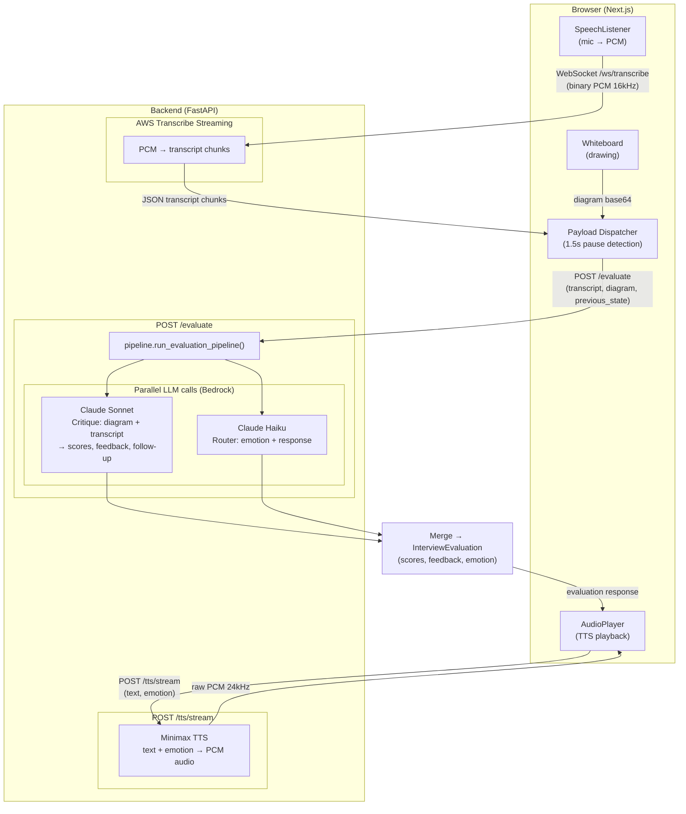

# AI Interview Tutor

An interview tutor powered by multiple AI agents: the candidate speaks and draws, and an AI interviewer evaluates answers, keeps context, and responds with natural speech. This repository includes a working implementation for **technical interviews** (algorithms, data structures, ML concepts) with voice, whiteboard, and real-time evaluation.

## Concept: Interview Tutor Using AI Agents

The system is built around the idea of an **AI interview tutor** that behaves like a human interviewer:

1. **Conversational flow** – The tutor greets the candidate, poses questions, and reacts to answers with follow-ups and feedback.
2. **Multimodal input** – The candidate can speak (voice) and draw (whiteboard), mirroring a real whiteboard interview.
3. **Multiple specialized agents** – Instead of one monolithic model, separate agents handle different roles:
   - **Evaluation agent** – Scores and critiques the answer (content, diagram, clarity) and suggests follow-up questions.
   - **Routing agent** – Decides tone and short verbal feedback (encouraging, skeptical, curious, etc.) so the tutor’s replies feel natural and context-aware.
   - **Speech-to-text** – Transcribes the candidate’s speech in real time.
   - **Text-to-speech** – Speaks the tutor’s replies with emotion so the interviewer has a consistent voice.

4. **Stateful conversation** – Each turn is evaluated with access to the previous tutor message and the current transcript and diagram, so follow-ups and probing questions stay coherent.

By splitting evaluation, routing, and speech into separate services (and optionally different models), the system can use the right model for each task (e.g. a stronger model for critique, a faster one for routing) and scale or swap components independently.

---

## How interview-technical Works

The **interview-technical** app is a full-stack implementation of this tutor for technical interviews (data structures, algorithms, ML). It uses AWS (Bedrock, Transcribe) for LLM and STT, and Minimax for TTS.

### High-level flow

1. **Startup** – The app greets the user and picks a random easy starter question (e.g. “Explain a binary search tree”, “What is SFT?”, “Explain linear regression”). The user clicks “Start interview” to begin.
2. **First message** – The tutor’s greeting plus the chosen question is added to the conversation and spoken via TTS (Minimax, emotional voice).
3. **Candidate speaks** – The user talks (and optionally draws on the whiteboard). Browser captures microphone and sends PCM audio to the backend over a WebSocket.
4. **Transcription** – AWS Transcribe Streaming turns the audio into transcript chunks, which are sent back over the same WebSocket and shown in the UI.
5. **Turn detection** – When the user pauses for about 1.5 seconds, the current transcript (and the whiteboard snapshot) is sent to the **evaluate** pipeline.
6. **Evaluation pipeline** – Two LLM calls run in parallel on AWS Bedrock:
   - **Critique (e.g. Claude Sonnet)** – Takes the transcript and optional whiteboard image. Returns scores (diagram, verbal, overall), per-aspect feedback, and an optional follow-up question.
   - **Router (e.g. Claude Haiku)** – Takes the previous tutor message and the new transcript. Returns an emotion label and a short verbal response to speak.
7. **Response** – The backend merges critique and router outputs (follow-up question or verbal feedback, plus emotion) and returns them to the frontend.
8. **Tutor speaks** – The frontend sends the response text and emotion to the TTS endpoint; Minimax returns PCM audio, which is played in the browser. The response is also appended to the conversation.
9. **Loop** – The conversation state (last tutor message) is kept as `previous_state` for the next evaluate call, so the tutor can ask follow-ups and stay on topic.

End-to-end: **mic + whiteboard → STT → transcript → pause → evaluate (critique + router) → TTS → tutor speaks**.

### Architecture

### Project layout

- **`src/interview-technical/`**
  - **`backend/`** – FastAPI app: `/evaluate`, `/tts/stream`, `/ws/transcribe`; pipeline (Bedrock Sonnet + Haiku), Minimax TTS client, AWS Transcribe streaming.
  - **`frontend/`** – Next.js app: InterviewUI (startup + conversation), Whiteboard, SpeechListener (mic → WebSocket), AudioPlayer (TTS playback), payload dispatcher (pause detection), Zustand store.
  - **`scripts/`** – e.g. `restart-dev.sh` to run backend and frontend together.

### Backend

- **Endpoints**
  - `POST /evaluate` – Body: `transcript`, `diagram_base64`, `previous_state`. Returns `InterviewEvaluation` (scores, design_aspects, verbal_feedback, follow_up_question, minimax_emotion, should_interrupt).
  - `POST /tts/stream` – Body: `text`, `emotion`. Returns raw PCM audio stream (24 kHz) for Minimax TTS.
  - `WS /ws/transcribe` – Accepts binary PCM 16 kHz 16-bit mono; sends JSON `{ "transcript": "..." }` chunks.
- **Pipeline** – `pipeline.run_evaluation_pipeline()` runs Sonnet (critique) and Haiku (router) in parallel, parses JSON, and merges into `InterviewEvaluation`. Diagram is optional (can be `None`).
- **Env** – `AWS_ACCESS_KEY_ID`, `AWS_SECRET_ACCESS_KEY`, `AWS_REGION` (Bedrock + Transcribe); `MINIMAX_API_KEY` (TTS).

### Frontend

- **Startup** – On load, a random starter question is chosen client-side (after mount to avoid hydration mismatch). User sees the question and clicks “Start interview”; the greeting + question is added as the first agent message and spoken via TTS.
- **Conversation** – Messages (user + agent) and live transcript are shown. After a 1.5 s pause, `runEvaluate` is called with the current transcript, whiteboard base64, and `previousState`; the response is appended and played.
- **State** – Zustand store holds transcript, messages, previousState, evaluation, and flags (interviewStarted, initialGreetingText, autoPlayEvaluation, etc.).

### Running locally

1. **Backend** – From `src/interview-technical/backend/`: `uv sync`, then `uv run uvicorn main:app --reload --port 8000`. Set `.env` as above.
2. **Frontend** – From `src/interview-technical/frontend/`: `npm install`, `npm run dev` (e.g. port 3000). Set `NEXT_PUBLIC_API_URL` if the API is not at `http://localhost:8000`.
3. Or use `scripts/restart-dev.sh` if it starts both backend and frontend.

---

## Summary

- **Concept**: An AI interview tutor that uses multiple agents for evaluation, routing, STT, and TTS, with stateful conversation and optional whiteboard.
- **interview-technical**: A concrete implementation for technical interviews: AWS Transcribe (STT), Bedrock Claude (critique + router), Minimax (TTS), Next.js + FastAPI, with a startup greeting, random easy starter question, and pause-triggered evaluation loop.
